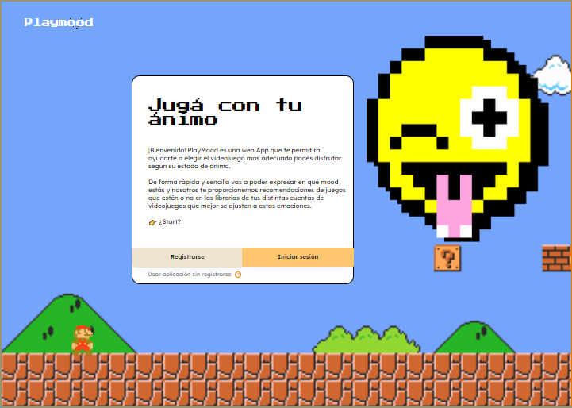
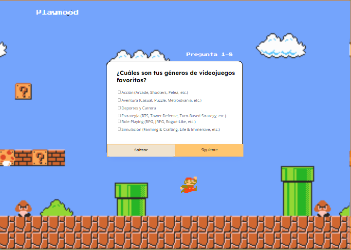
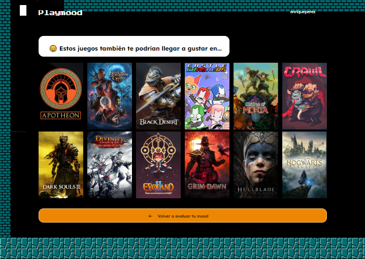

<h1 align="center">c17-106-m-nocode</h1>
 

  

Juega con tu estado de ánimo

--------------

<h2 align="center">💼 Equipo de trabajo</h2>

### Desarrollo:
| Nombre   | Github                                  | Linkedin                                |
|----------|-----------------------------------------|-----------------------------------------|
| Sofia Isoardi Prieto | [Github](enlace/al/perfil/github)    | [Linkedin](enlace/al/perfil/linkedin)|
| Elias David Jacob | [Github](enlace/al/perfil/github)    | [Linkedin](enlace/al/perfil/linkedin)|
| Valentin Noel Hurtado | [Github](enlace/al/perfil/github)    | [Linkedin](enlace/al/perfil/linkedin)|

## 💼 Prueba de trabajo

--- 

### ⚙ ¿Cómo probar nuestro proyecto?

Te invitamos a descubrir nuestra plataforma a través del siguiente enlace:

[Acceder al proyecto](https://playmood-final-version.bubbleapps.io/version-test)

Durante este período de simulación, estuvimos trabajando en esto.

--- 

### 🔧 Como equipo

Como equipo, mantenemos una comunicación constante y trabajamos juntos para resolver todas las problemáticas que puedan surgir. Utilizamos Trello como nuestra herramienta principal de organización. Puedes ver nuestra lista de tareas actualizada a través del siguiente enlace:

[Ver lista de tareas en Trello](enlace_a_trello)

Esta herramienta ha sido invaluable para nuestra organización. Nos ha facilitado la comunicación, la asignación de tareas, el seguimiento de los tiempos del proyecto y otros aspectos clave.

Apreciamos la eficiencia que nos brinda Trello y cómo contribuye al éxito de nuestro equipo.

### 🕹 Durante el proyecto

#### • Etapa 1: Organización y Diseño
Durante esta fase inicial, nos centramos en organizar el desarrollo del proyecto utilizando Trello como herramienta principal. Trabajamos en colaboración con el diseñador para planificar y diseñar la estructura y apariencia de la página.

#### • Etapa 2: Superando Obstáculos
A pesar de contar con una comunicación eficaz y un buen ambiente de equipo, nos enfrentamos a diversas dificultades a lo largo del proyecto, especialmente en el ámbito del funcionamiento de la plataforma de desarrollo "Bubble". Tuvimos que realizar investigaciones por nuestra cuenta para comprender el funcionamiento de Bubble, incluyendo la creación de condicionales, la gestión de bases de datos y otros aspectos técnicos.

#### • Etapa 3: Pruebas de Fiabilidad y Retroalimentación
En esta etapa, comenzamos a realizar encuestas y recopilar feedback de terceros. Participamos en videollamadas organizadas por "No-Country" para recibir asesoramiento sobre la plataforma de desarrollo y el concepto de "No-Code". Posteriormente, iniciamos encuestas para evaluar la funcionalidad de nuestra página, la diversidad de emociones y géneros de videojuegos, entre otros aspectos relevantes.

#### • Etapa 4: Desarrollo y Lecciones Aprendidas
Durante el desarrollo del proyecto, cada miembro del equipo se centró en una tarea específica e indispensable. Esta fase nos permitió adquirir valiosas lecciones y habilidades. Aprendimos a trabajar de manera colaborativa, a superar obstáculos técnicos y a adaptarnos a las necesidades del proyecto. La experiencia nos ha demostrado la importancia de la perseverancia y la flexibilidad en el desarrollo de proyectos innovadores.

### 📋 Encuestas

A continuación, dejamos constancia de las encuestas realizadas como precedente:

[Ver la encuesta](enlace_a_las_encuentas)

<h2 align="center">🎮 Fotos del proyecto</h2>

|  | 
|:--:| 
| **🕹 Inicio de la pagina** |

|  |  |
|:--:|:--:|
| **🕹 Iniciando las preguntas** | **🕹 Recomendaciones varias** |

#### Estas son algunas de las páginas de nuestro proyecto. Actualmente se encuentra en fase de desarrollo, por lo que es posible que algunas funcionalidades no funcionen como se espera o que, bajo ciertas condiciones, se presenten fallos inesperados.
#### Parte de lo mostrado puede ser solo visual y podría no incluirse en el proyecto final.

#### ¡Gracias por su interés y paciencia mientras trabajamos en mejorar nuestra plataforma! ♥

